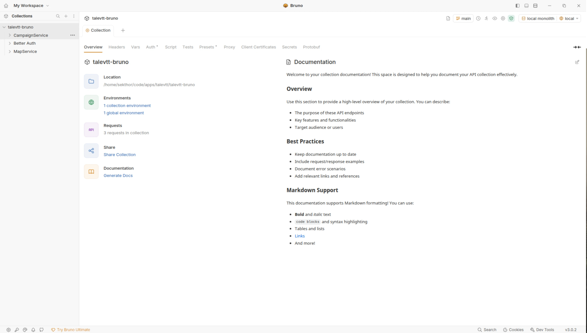
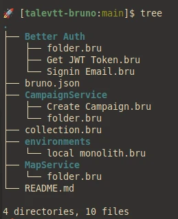
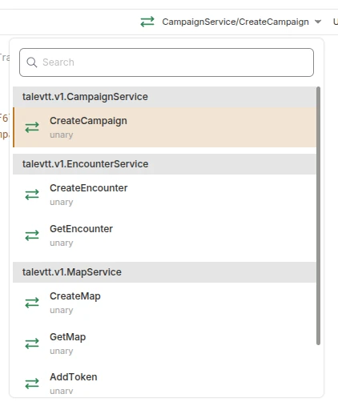

+++
title = 'Friendship ended with Insomnia, Bruno is now my best friend'
date = 2026-02-14T12:27:07+01:00
tags = ["bruno", "api-testing"]
technologies = []
+++

The postman days are long over for me.
I switched my go-to api testing tool, when postman became cloud-only.
I don't like having to be logged in to my dev tools.
I don't like when version control is not really git friendly.

For quite some time I was using Kong Insomnia.
While it allows me to keep my files local, I have never really enjoyed the experience.
It had everything I needed, but seems to go down the same enterprise-plan road that postman went.

Enter [bruno](https://usebruno.com/); the new kid on the block.
I really like how clean bruno looks and how it has everything I need (grpc, rest, websockets).
I love that it is open source and that it actually seems to start to get quite a bit of traction.

Sure, there are also paid features, but those are negligible.
I don't need to pay for cleaner git integration in the frontend, I can just use plain old git.
And very cleanly so.

Bruno projects are actual directory structures on my file systems.
The files use the bruno format (or even support the [opencollection](https://www.opencollection.com/) standard), both very git friendly and manually editable.

My only problem so far, was getting it to read proto files from a buf project.
Bruno does not seem to support buf.
But I don't think any of the other tools do either.
But that is ok.
Getting the grpc api spec using reflection works like a charm.

I am in awe of how user friendly the entire experience is and how cleanly the project is [documented](https://docs.usebruno.com/).
I have decided to use bruno for all my current projects.

10/10 would recommend.
