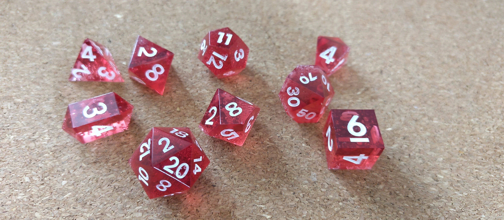
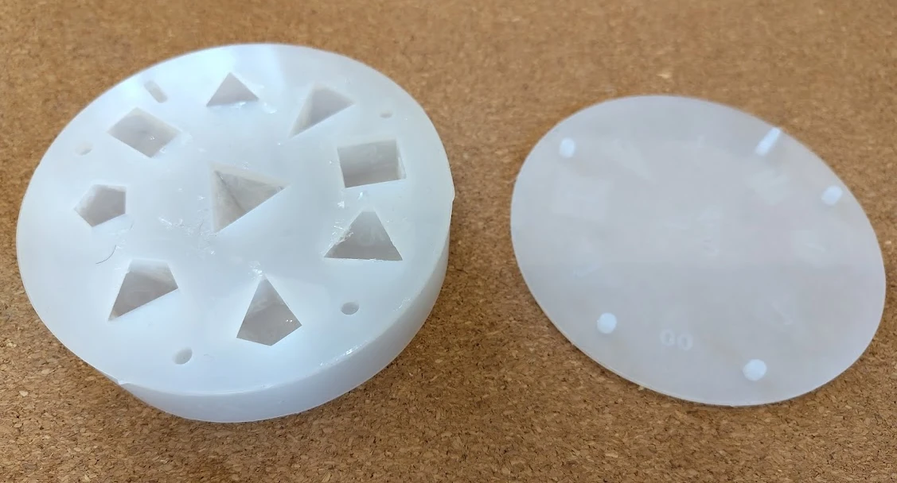
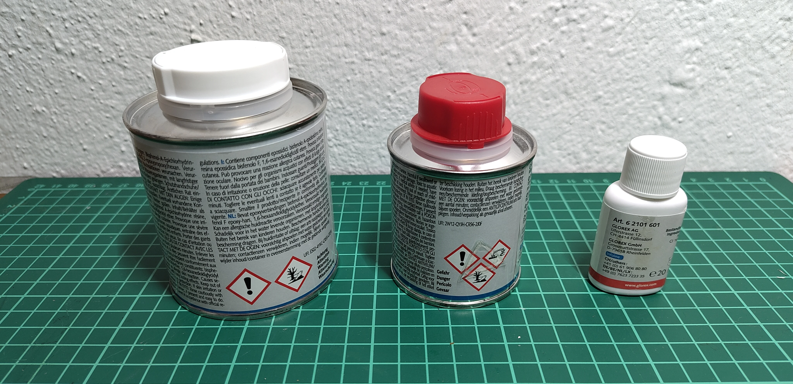
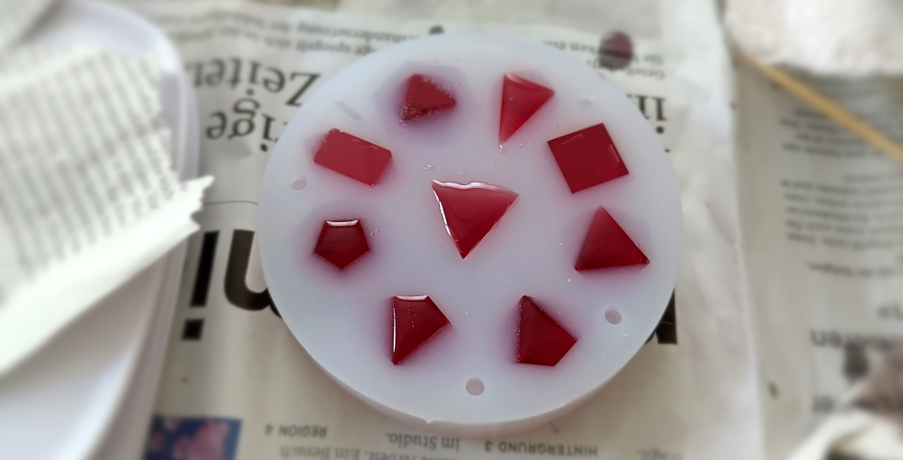
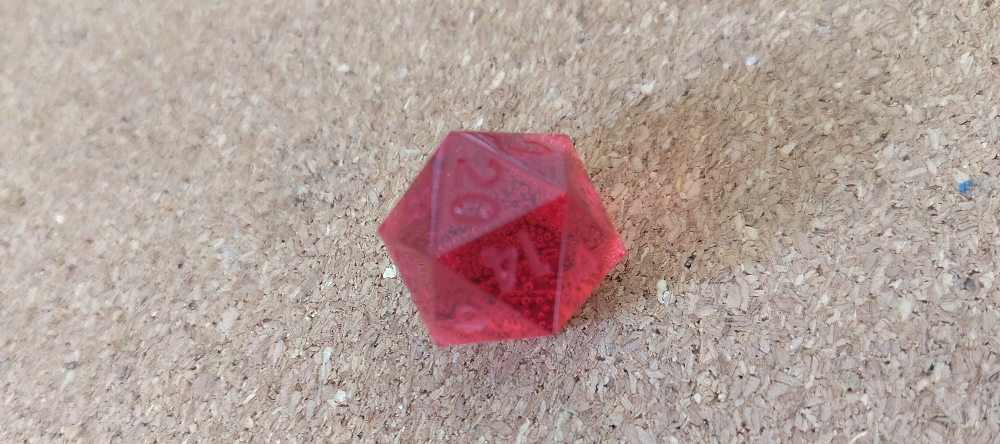
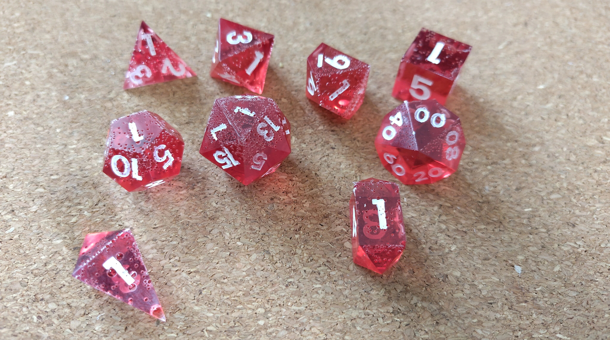

+++
title = 'Dice Making: First Batch'
date = 2025-05-05T12:07:38+02:00
tags = ["dice", "diy"]
technologies = []
+++

As a fan of both pen-and-paper games and DIY, I recently decided to try manufacturing my own dice.  
I must admit, I can be a bit of a [buyhard](https://www.urbandictionary.com/define.php?term=BuyHard) sometimes.  
After just over a year of discovering this hobby, I’ve already accumulated a handful of dice sets.  
I know that dice hoarding is a common illness among players (*"dice goblins"*), but I won’t let it get out of hand—at least not by purchasing more dice.  
The guy equivalent of girl math is thinking something is free if you make it yourself, even if the materials and time cost you *n*-fold the retail price.

Without building it up too much, this is what the final dice turned out like.  
I wasn’t expecting the first batch to be perfect—and they’re far from it.  
There are a lot of blemishes, and some faces are so covered in bubbles that you can barely make out the numbers.  
But overall, I’m quite happy with the result.  
The first pour was a learning experience—just to get a feel for how the mold and materials behave and to gather ideas for optimizing the process.

## Making the Dice

I bought a cheap silicone mold online.  
When it arrived, I was pleasantly surprised—the quality was better than I expected for something I paid almost nothing for.

The mold includes 9 dice shapes: the standard 7 polyhedral dice used in most TTRPGs, plus two additional d4s.

### Resin Casting

I picked up some epoxy resin at the hardware store, along with red epoxy dye.  
Pictured left to right: the resin, the hardener, and the red dye.

I didn’t want to overthink the first pour—I just wanted to go for it.  
With a project like this, I expect the first few attempts to go wrong and to learn from my mistakes.  
So I wasn’t aiming for perfection—I was embracing the likelihood of failure to see what my first mistake would be.

I mixed the resin, hardener, and dye according to the instructions and started pouring.  
Once filled, the attempt made a decent first impression.  
I did notice some minor air bubbles (also visible in the picture), but I wasn’t too concerned about them on the first try.

When I put the lid on, I realized that this was probably the trickiest step:  
figuring out how to place it without creating air pockets on the top faces.  
Well, that’s exactly what happened.  
I removed the lid after seeing some noticeable bubbles, added some extra material to compensate for the spillover, and carefully put the lid back on.

Now I had even more excess material being pushed between the mold and the lid.  
I pressed the lid down harder to try and squeeze out the extra epoxy, but there was still a visible layer in between.

Now for the hardest part:  
patiently waiting 48 to 72 hours without touching the mold or interfering with the curing process.  
Obviously, I failed.  
I touched the mold every few hours—lifted it, turned it, tried to see what was going on inside.

### Demolding the Dice

After (almost) 48 hours, I couldn’t wait any longer and checked on the dice.  
They were far from perfect—but that was expected.  
The bubbles had risen to the top sides, but surprisingly, the lower sides were almost perfect.

The mold has a lid that’s supposed to fit snugly on top, but only if there’s no spillover.  
Since I poured the resin slightly above the edge to avoid underfilling, there was a small amount of overflow.  
It cured to a thin layer about 0.1–0.3mm thick.  
While technically minor, this raises the top face slightly, making that face smaller—and the die unfair.  
I don’t think this tiny difference affects the dice’s entropy in a meaningful way, but I’ll try to reduce it in future casts.

### Painting the Numbers

I painted the numbers using the finest brush I had (000) and standard acrylic paint.  
Since the paint was quite viscous, I mixed it with a bit of water.  
My idea was to get it runny enough that I wouldn’t have to “paint” the numbers so much as flood the grooves and let the paint settle itself.  
But when diluted enough to do that, the paint coverage was too weak.  
Also, the surface tension of the water-paint mix often prevented it from reaching tight corners.  
So I ended up applying it manually with the brush.

This makes me think that better paint would help—probably something designed for painting miniatures would work great for this.

## Conclusions

I’m quite happy with the result, despite the flaws.  
For the next batch, I’ll consider:

- Stirring the resin more carefully to minimize bubbles  
- Vibrating the resin before pouring to release trapped air  
- Pouring slowly to reduce new bubbles  
- Filling the mold completely, with minimal excess  
- Vibrating the mold after pouring  
- Pressing the lid from the center outward to avoid trapping air
