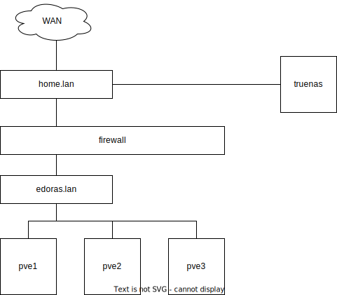
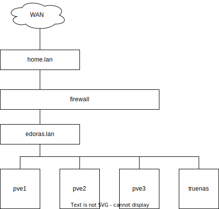
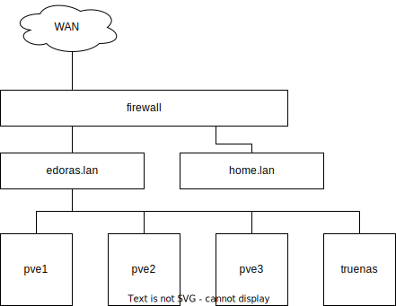
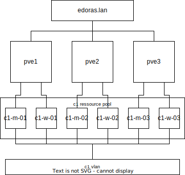

+++
title = 'Homelab Cluster'
date = 2025-12-17T10:09:40+01:00
tags = ["homelab", "virtualization", "proxmox"]
technologies = ["proxmox", "fortigate"]
draft = false
+++

I have recently rebuilt my homelab and am now finally constructing it in a more durable way.
This is something I have wanted to do for a long time, yet always lacked the motivation to pull through.
However, a recent (admittedly careless) Truenas update with partially unfortunate outcomes has lead me to reconsider.
I have always considered a virtualization cluster overkill for my homelab or rather I considered it unnecessary overhead.
All I really needed so far was Kubernetes which works on bare metal just fine.
But now more than ever, I want to tinker with my own cloud infrastructure.
So I am building my own hypervisor cluster.
I have chosen proxmox for now.
At some point I think it would be cool to tinker with open stack and do the whole cloud approach "for real".
But for now, a simple VM Host will do just fine.

## Architecture

Big cloud providers work with `regions` and `zones`.
I decided to do the same.
For the naming scheme I have chosen to go with middle earth locations rather than their actual location.
So regions will be named after kingdoms and zones after cities in them.
I am just creating the one zone right now which is `edoras` in the `rohan` region.
Or `ro-ed` for short.

Within `ro-ed` I have two HP Elitedesk Mini PCs running proxmox.
A third one is on the way, and important for high availability (HA), as a node failure leaves the other node by itself and can thus never reach a majority quorum vote.

My homelab already has a pretty beefy Truenas.
I will leave that untouched for now, but am planning to move that into the edoras zone.

Currently the whole homelab network is plugged into my home network as wan access.
The truenas is box is still attached to the home network.

The plan is to move truenas into the homelab as well.

And eventually move the home network behind the firewall as well having it act as the primary router.

Related virtual machines (such as nodes of a k8s cluster) I group into proxmox `resource pools` and put into a dedicated VLAN.
