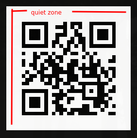
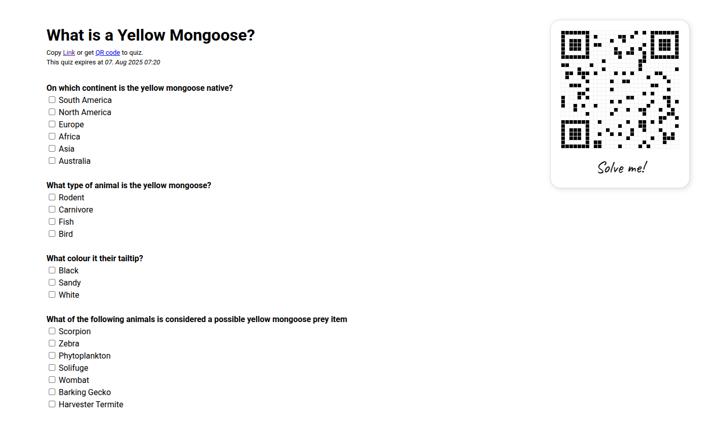
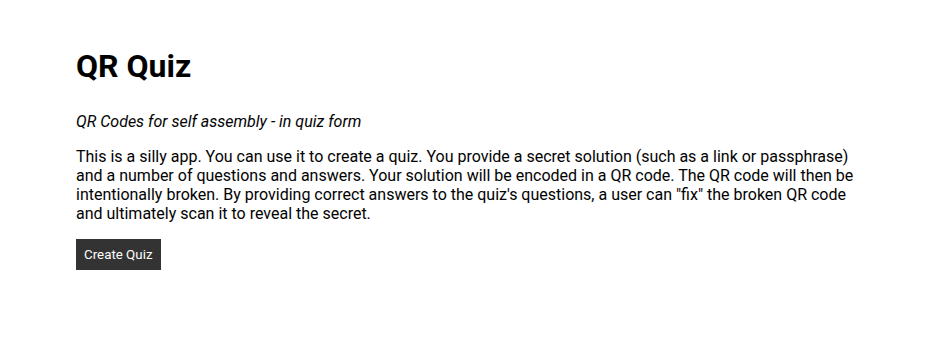
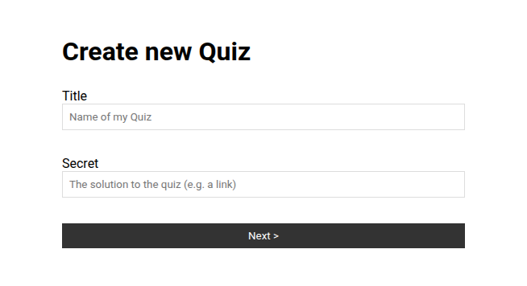
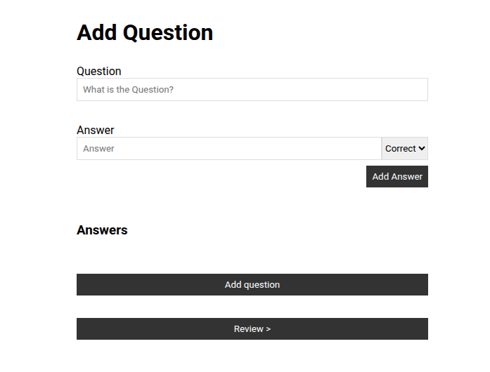

+++
title = 'QrQuiz: A silly App'
date = 2025-03-19T14:35:25+01:00
tags = ['golang', 'qr code', 'quiz', 'sqlite', 'gin']
+++

Recently I had a stupid idea for an event: send out invitations with a QR Code to color in yourself.
Invitees would receive an empty square grid and a number of coordinates.
Only when they color in the QR code correctly, will they be able to scan the invitation and sign up for the event.
Puzzlers would love this.
Everyone else would hate it.
The latter is why I found this such a funny idea.

Also, rather than "just" providing the coordinates of "set" (dark) pixels (the correct coordinates to color in), I thought, I could hide them in a quiz. Every answer has a coordinate. Right answers give correct coordinates, wrong answers incorrect ones.
Only if you solve the quiz correctly and color in all the right, "missing" pixels, will you be able to scan the QR.

I ended up not doing that, but the idea stuck with me.
Maybe I am just annoying like that.
But maybe I am not the only one.
I started thinking that this would maybe be funny to other people as well.
So I built a little proof of concept.

## PoC

With a little bit of html, css and vanilla javascript, I built a table with fixed size cells.
Each with an `id` corresponding to it's `x,y` coordinates.
A javascript function would toggle a css class for the respective cell, to set it to `dark`.
I added a text input for coordinate and a submit button and could set and unset (toggle) given pixels like this.
From that I implemented placeholder questions, where answers each had a pixel coordinate assigned.
When their checkbox was was clicked (checked/unchecked), the toggle function was called with those coordinates and set the corresponding pixel.

This is what that looked like:


## The concept takes shape

OK cool.
The idea should work.
At least after the PoC, I am fairly confident it will.
What now?
Code away!

1. I need a sever, that can handle submission of new quizzes, generate a "qr puzzle" and let users solve the puzzle by solving the quiz.
1. I like go. I will write it in go.
1. I need a way to generate QR codes in a data format that I can work with.
   Meaning, I need to be able to generate QR codes and then manipulate them in a way, where I can get the coordinates of individual pixels.
   Some of these pixels I want to omit from the initial QR code and assign them to correct answers.
   I found [skip2/go-qrcode](https://pkg.go.dev/github.com/skip2/go-qrcode).
   It allows me to generate a QR code Bitmap.
   A two-dimensional slice of bools (`[][]bool`).
   Perfect!
1. I need a frontend.
   I do not want to over-complicate it.
   I work with data in the go backend.
   Hmm...
   Why not just go for go templating?
   Yes!
   Let's do that.
   For client-side interactivity, I shall just stick to vanilla javascript.
   Not a fun way to work, but for what little interactivity I need definitely simpler, than working with any of the larger frameworks.
   
What do we need?

1. a form where users can create new quizzes
    1. Title
    1. Solution (e.g. a link) to be encoded in the QR code
    1. *n* Questions with *m* answers each. Originally thought to be single-choice, eventually turned out be more fun as multiple choice.
1. a form submission, that automatically turns the form data into qr quiz
    1. Create QR from secret
    1. Steal a *set* pixel for each correct answer and assign it to the answer
    1. Assign an *unset* pixel to each incorrect answer
1. a quiz template with an incomplete QR code and the quiz Q&A
    1. correct answers recreate the QR by re-inserting missing pixels
    1. wrong answers insert pixels, that were meant to remain unset

## Implementation

I started by creating am http server with html templates.
Css and JS files included as static assets.
This part was fairly straight forward.

The core complexity was in the domain layer.
How do I take the form data, generate the QR code and corrupt it in a way, where the correct answers will recreate it.
Quiz data from the form looks like this when it is submitted.

```json
{
    "title": "The title of the Quiz",
    "secret": "https://secret.link/to/solution",
    "questions": [
        {
            "question": "What is the meaning of life?",
            "answers": [
                {
                    "text": "42",
                    "correct": true
                },
                {
                    "text": "43",
                    "correct": false 
                }
            ]
        }
    ]
}
```

They are assigned and id ([cuid2](https://pkg.go.dev/github.com/nrednav/cuid2)) and the secret is encoded into a QR code bitmap.
Using the aforementioned go library we can generate this bitmap using the `low` recovery level (see section fault tolerance) and omitting the quiet zone.

### Choosing eligible Pixels: Of the Quiet Zone and Position Markers

The quiet zone is a frame around the code itself, specified in the QR spec.
Depending on the version of the QR code, it may not always be the same.
It is always meant to not contain any visual noise, to allow for better optical recognition while scanning.

Even if we don't know the spec, we intrinsically recognize, that there probably should not be any pixels in that frame.
Thus, it makes no sense to include it in the set of pixels we want to work with.
As there are exclusively unset, white pixels in the quiet zone, picking them for wrong answers would make them stand out as obvious wrong answers.



The characteristic three squares in three of the corners mark the orientation of the QR and are known as "positions".
For them the same holds true:
placing an incorrect pixel in that area would immediately stand out.

Thus I came up with a function to choose eligible pixels only.
It excludes the quiet zone, the position markers and a 1-module (pixel) wide border around each position.
Answers would only be assigned Pixels from this "eligible" area.
For more details, check out the [implementation](https://github.com/sekthor/qrquiz/blob/main/internal/domain/puzzle.go#L46).


### The Problem: Fault tolerance of QR Codes

Now as it turns out, QR Codes have fault tolerance built-in *("recovery level")*.
This is so you can loose part of the QR code (print error, stains, or ripped corner), and still scan it.
Even at the lowest recovery setting, you can still loose up to 7% percent of a QR code.

Side note: That is why you can put your logo in the middle of a QR code and still have it scan correctly.
Provided of course, you do not cover more pixels, than the recovery level of the QR allows you to "loose".

This is kind of messing with my concept.
I don't mind having a bit of a error tolerance in the quiz, but 7% of incorrectly answered questions seemed too high.
The simple solution I came up with:
Assign multiple pixels per answer instead of just one.
In fact, now I assign almost every pixel, which is actually quite noticeable in the amount of rows stored in the database per quiz.

### Assigning Pixels

After eligible Pixels are chosen, they are assigned to answers.
In theory, I determine the amount of pixels per question like so:

```
min((unsetPixelCount/wrongAnswerCount),(setPixelCount/correctAnswerCount))
```

However, there were some extra guardrails I had to install, as providing no correct (or wrong) answers would result in a division by 0 error.

Also, it is theoretically feasible to provide more answers in a quiz, than there are pixels in a QR code.
Should this happen, the request will be rejected with an http `400 Bad Request`.

### Storing the quiz

The initial implementation was saving quizzes in memory.
Soon after I added sqlite into my persistence layer.

1 `quiz` has n `question`s and a `question` has n answers.
These are all fairly simple foreign key relations.
However, the amount of joins to fetch a single quiz is quite high and I am not too fond of that.
From the small number of quizzes my test users have generated I compute an average of 44 pixels per answers with the highest count being 206 pixels per answer (small quiz with only two answers).

```sql
SELECT AVG(pixel_count) FROM (SELECT COUNT(id) AS pixel_count FROM pixels GROUP BY answer_id);
44.015625

SELECT MAX(pixel_count) FROM (SELECT COUNT(id) AS pixel_count FROM pixels GROUP BY answer_id);
206
```

Also I am not a fan of how I stored the QR codes themselves.
I am storing only the corrupted QR and the answers.
From that, the original QR can be recreated.
That is fine.

However, storing the bitmap of the QR I did in a rush.
I needed to implement the `valuer` and `scanner` interface for the `Bitmap` type.
And I did not want to waste time on thinking about a cool and efficient marshalling scheme.
So what did I do?
JSON.
Yep, I am serializing a two dimensional array of bools into json.
This is stupid.
I know.
Every `0` or `1` boolean is now a string of `true` or `false` in my database.
In a comma delimited list of lists.
I know.
But it was fast to get started and is now one of my top priorities to get fixed.

## Final Result

I am quite happy with the final result.
There are still a couple of things to improve but the current application is surprisingly close to what I had in mind initially.
There is a landing page, a (maybe too) simple form to create quizzes and upon form submission, you receive a link to your quiz.
Here are some impressions:



*This is what a quiz looks like*



*The landing page is quite simple*



*This is how you create a new quiz*



*And how you add questions with answers to it*

## Playing the game

If you would like to test the app, at the time of writing there is a demo running [here](https://qrquiz.sekthor.dev).
