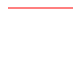
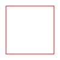
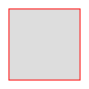
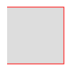

+++
title = 'SVGs: Drawing simple paths with straight lines'
date = 2025-05-09T22:35:30+02:00
tags = ["svg"]
technologies = []
+++

I like the svg vector graphic format.
The coolest thing about vector graphics is, that we do not need to worry about image quality, depending on what size the image is displayed in.
For a web dev perspective this is a huge benefit for responsive layouts.
Who knows on what weird device your user is displaying the page?
With pixel based images you can create high quality images, that explode in size, or you have to live with the fact that on particularly big screens you image might be pixelated.

With vectors, you simply store paths, that are then rendered on the screen.
They scale to any size imaginable.
I love using SVGs for that purpose, but have never really understood how they work.
Now, I am trying to change that.

## Format

An SVG file is actually just some HTML syntax.
This means we can actually "code" our images if we like to.
Also we can use code, to manipulate the HTML and generate or change an image programmatically.
Think of the possibilities.
It is totally feasible to use javascript to animate our SVG image for example.
Or to load image content in a meaningful order... Cool stuff.

So the basic layout is this:
We have an opening and closing `<svg></svg>` html tag.
An svg tag has `height` and `width` properties to specify the size of our image. 
Within that tag we can then include one or more paths.
A path is a collection that have coordinates from your "shape" is generated.
A path can have a `stroke` color and a `fill` color.

A simple svg would look like this:

```html
<svg width="100" height="100" xmlns="http://www.w3.org/2000/svg">
    <path d="M 10 10 L 90 10" stroke="red" fill="none"/>
</svg>
```

We have an svg that has a width of 100px and a height of 100px.
It contains a path.
The path starts, by moving the starting point to the coordinates of `x=10` and `y=10` by using the "move" command `M`.
It then draws a straight line `L` from our current location to the coordinates of `x=90` and `y=10`.
So, we simply move 80px to the right.
We specify a stroke color of `red` and no fill color.
On a single line we don't actually have any area to fill.
The image looks like this:



Now that we know how to draw line we can actually use that to draw a little rectangle.
We do that by simply continuing the path with straight lines (`L`) from the current location to the next coordinates:

```html
<svg width="100" height="100" xmlns="http://www.w3.org/2000/svg">
    <path d="M 10 10 L 90 10 L 90 90 L 10 90 L 10 10" stroke="red" fill="none"/>
</svg>
```

That will look like this:



### Closing the path

In the previous example, we completed the square, by moving back to the initial position of `x=10,y=10`.
But we can actually have the format to that by it self with the `Z` command, to return to the initial position of the path.

```html
<svg width="100" height="100" xmlns="http://www.w3.org/2000/svg">
    <path d="M 10 10 L 90 10 L 90 90 L 10 90 Z" stroke="red" fill="none"/>
</svg>
```

Notice how the tailing `L 10 10` was simply replaced with `Z`.

### Fill colors

Now that we actually have some area, we can define a fill color.
Any kind of valid html color specification should work here (names, hex, rgb, ...)

```html
<svg width="100" height="100" xmlns="http://www.w3.org/2000/svg">
    <path d="M 10 10 L 90 10 L 90 90 L 10 90 Z" stroke="red" fill="#ddd"/>
</svg>
```



If we would not close our path by returning to the initial position, the fill would just assume the shape of what the `Z` command would have done.
But it would not create a stroke.


```html
<svg width="100" height="100" xmlns="http://www.w3.org/2000/svg">
    <path d="M 10 10 L 90 10 L 90 90 L 10 90" stroke="red" fill="#ddd"/>
</svg>
```


Notice the missing `Z` and that in the final shape, there is not stroke closing the square.
Still, the fill shape is delimited by where a straight line from the current position to the initial position would have been.


