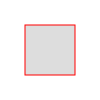

+++
title = 'SVGs: Shapes'
date = 2025-05-12T21:09:49+02:00
tags = ["svg"]
technologies = []
+++

In SVGs we do not need to draw everything with a path.
For common basic shapes, there are predefined tags, that we can use.
To create a square similar to the one in the last post for example, we can do this:

```html
<svg width="100" height="100" xmlns="http://www.w3.org/2000/svg">
    <rect x="25" y="25" height="50" width="50" stroke="red" fill="#ddd"/>
</svg>
```



This creates a 100x100px SVG, with a gray 50X50px square, with a red outline (stroke).

A circle takes a x and y coordinate (`cx`,`cy`) for the center point and a radius `r`.

```html
<svg width="100" height="100" xmlns="http://www.w3.org/2000/svg">
    <circle cx="50" cy="50" r="25" stroke="red" fill="#ddd"/>
</svg>
```


