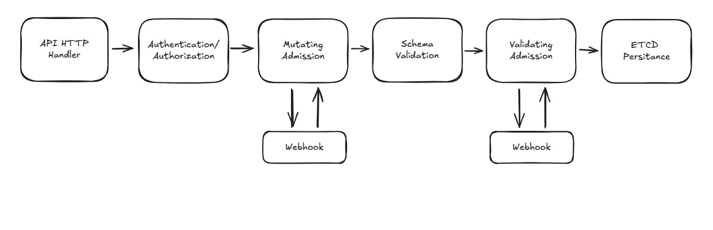

+++
title = 'Validating Admission Policies'
date = 2025-04-11T09:08:27+02:00
tags = ["kubernetes", "security"]
technologies = ["kubernetes"]
+++

Recently I was evaluating policy engines such as [OPA Gatekeeper](https://open-policy-agent.github.io/gatekeeper/website/) and [Kyverno](https://kyverno.io/) to increase security in Kubernetes clusters.
In Kubernetes you can leverage policy engine like that into admission control.
However since Validating Admission Policies (VAP) were introduced in k8s (stable since 1.30), a policy engine may not be needed any more.

## Kubernetes admission

Performing CRUD operations on kubernetes objects is done via the kube-api.
Requests are authenticated by providing the tokens from the kubeapi.
If a user is allowed to perform a certain action, the request still needs to pass through a chain of checks before the change is persisted in ectd.
Most notably, the schema of the object needs to be validated.
We should not be able to submit invalid Kubernetes objects.



These checks are performed by the admission controller.
But, we can plug into that chain, to perform our own custom validation and/or mutations.
For example we can have an external service that performs can handle a validation request and respond with a validation response.
The kubeapi will call our service via a webhook.
This is how we can plug external policy engines into our kubeapi.
However, this approach requires exactly that: an additional external service.
We will thus need extra resources to run our engine.

## VAPs

Since kubernetes 1.30 we have stable support for VAPs.
This is a k8s-native policy that we can deploy, with custom validation rules that will be evaluated by the admission controller itself.

Policies are written is CEL, a simple policy language and deployed wrapped in a kubernetes object.

A policy may look like this:

```yaml
apiVersion: admissionregistration.k8s.io/v1
kind: ValidatingAdmissionPolicy
metadata:
  name: "max-replicas-deployments"
spec:
  failurePolicy: Fail
  matchConstraints:
    resourceRules:
    - apiGroups:   ["apps"]
      apiVersions: ["v1"]
      operations:  ["CREATE", "UPDATE"]
      resources:   ["deployments"]
  validations:
    - expression: "object.spec.replicas <= 5"
      message: 
```

The match constraints determine what objects the policy will be evaluated with.
They use the `GVK` model (`Group`, `Version`, `Kind`) to specify the api version and kind of applicable objects.

The `failurePolicy` specifies the evaluation result of the policy if any of the validations return false.
So in the example we check if the the replica count is lower or equal to five.
If it was 6, the evaluation was to return `false`.
In that case our `failurePolicy` (here `Fail`) would take effect.

In order for the VAP to actually to anything we need to bind it to a scope using a `ValidatingAdmissionPolicyBinding`.
We could use a namespace selector to specify applicable namespaces.
If we leave `matchResources` blank, the policy will apply cluster-wide.

```yaml
apiVersion: admissionregistration.k8s.io/v1
kind: ValidatingAdmissionPolicyBinding
metadata:
  name: "max-replicas-deployments"
spec:
  policyName: "max-replicas-deployments"
  validationActions: [Deny]
  
  # apply in namespaces that have label environment:test
  matchResources:
    namespaceSelector:
      matchLabels:
        environment: test
```

The `validationAction` specifies what to do with a failed Policy.

- `Deny` means, that we deny the admission request.
- `Warn` will not deny the admission request. It will only warn the user about the violation.
- `Audit` will include the message in the audit event for this request.

So with our example deployed, we can attempt to deploy a deployment with 6 replicas.
The request will be denied with the following message.

```plaintext{lineNos=false}
kubectl apply -f deploy.yaml 
The deployments "test" is invalid: : ValidatingAdmissionPolicy 'replicas' with
binding 'replicas' denied request: failed expression: object.spec.replicas <= 5

```

## Params

It is possible parameterize polices.
Lets say, we want to change the max replica value to 6 but have multiple expressions referencing it or even multiple policies.
It would be easier to put in some sort of a variable, so we do not have to touch the policies to change parameters.

