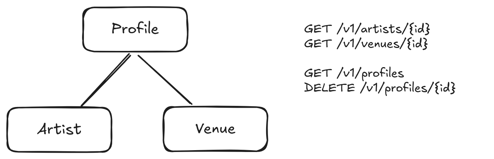

+++
title = 'Index'
date = 2025-01-18T00:17:51+01:00
draft = true
+++

I have recently started a project written in go where I want users to be able to create profile pages.
The project would allow for multiple differnt entities to have profiles.

So for example a user could have a profile, their band could have a profile, etc.
The Entities have different specific attributes and features, but still I wanted to be able to abstract the profiles into their common `Profile` type.



The reason for that being:

- Listing profiles of mixed child types, not just a specific type
- Managing ownership for all profiles
- ...

> Certain actions I want to generalize for multiple different entities.
> In these cases, I want to treat them all as the same kind of different varieties.

Now, go is not object oriented and does not support polymorphism.
But the ORM I am using (gorm), does have some support for polymorphic types.

```go
type Profile struct {
    repo.Model // custom implementation of gorm.Model, but with custom ID format (cuid2)
    ProfileType string // the gorm polymorphic type (name of the child entity table)
    Name string // every Profile has a name (band name, venue name, ...)
    ...
}
```

This generic Profile can now be included in all my entities that have profiles.
They need to be marked as polymorphic associations.
Gorm will then always save an entity's profile in the share Profile table, rather than create an `<entity>_profiles` table for every entity.

```go
type Artist struct {
    repo.Model
    Profile Profile `gorm:"polymorphic:Profile;polymorphicId:ID;"` 
    
    // Attributes that apply only to Artists, not every Profile
    Genres []Genre `gorm:"many2many:artist_genres"`
}
```

Note, that I am explicitly reusing the `ID` field (part of repo.Model), rather than an additional `ProfileID` field in the Artist.
I wanted to ensure, that a Profile and it's child entity always share the same primary key value.
This seemed most intuitive for a 1:1 relationship.

## What that enables me to do

- I can create an Artist or any other child entity, and directly create a corresponding profile
- I can list all profiles, regardless of what entity they are associated with
- I can easily delete Profiles with a single `DELETE /v1/profile/{id}` endpoint

## A note on deletion

To ensure an Artist is also marked as deleted, when I delete it's "parent" profile, I am using gorm delete hooks.
This way, I can simply delete a profile (regardless of type) and make sure, the type specific stuff is also deleted.

```go
func (p *Profile) AfterDelete(tx *gorm.DB) error {
	switch p.ProfileType {
	case "artists":
		if err := tx.Where("id = ?", p.ID).Delete(&Artist{}).Error; err != nil {
			return err
		}
		
	case "venues":
		if err := tx.Where("id = ?", p.ID).Delete(&Venue{}).Error; err != nil {
			return err
		}
	}
	return nil
}
```
